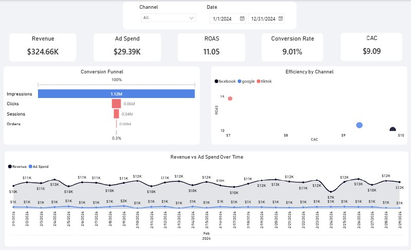

# Marketing Analytics Platform

## Dashboard

### Overview

## 1. Business Problem

The goal of this project is to analyze marketing performance and understand:

- Which channels generate the highest revenue
- Which channels are cost-efficient
- Where users drop off in the funnel
- How marketing spend impacts business outcomes

This allows data-driven decisions on budget allocation and optimization.

---

## 2. Architecture

CSV → Python ETL → PostgreSQL (raw) → dbt → marts → Power BI

### Layers:

- **raw** – original data loaded from CSV
- **staging** – cleaned and standardized data (views)
- **marts** – aggregated business-ready data (tables)
- **Power BI** – visualization and insights

---

## 3. Pipeline

### Step 1. Data Ingestion
- CSV files:
  - users
  - sessions
  - orders
  - ads_data
- Loaded into PostgreSQL (`raw` schema) using Python

---

### Step 2. Data Transformation (dbt)

#### Staging Layer
- Clean data
- Normalize formats (dates, text)
- Prepare for joins

#### Fact Tables
- `fact_sessions` – session-level data
- `fact_orders` – order-level data
- `fact_marketing` – aggregated ad performance (date + channel + campaign)

#### Marts
- `metrics` – aggregated metrics by date and channel
- `funnel` – conversion funnel

---

### Step 3. Visualization
- Power BI dashboard:
  - KPI cards
  - Funnel
  - CAC vs ROAS scatter
  - Revenue vs Spend over time

---

## 4. Metrics

### Core Metrics

- **Revenue**

SUM(revenue)

- **Ad Spend**

SUM(ad_spend)

- **CTR (Click-Through Rate)**

clicks / impressions

- **Conversion Rate**

orders / sessions

- **CPA (Cost per Acquisition)**

ad_spend / orders

- **ROAS (Return on Ad Spend)**

revenue / ad_spend

---

### Notes

- Revenue and Ad Spend are additive → use SUM
- Ratio metrics (CTR, CR, ROAS) are recalculated from base metrics
- CPA is used instead of true CAC (simplified marketing metric)

---

## 5. Insights

### Channel Performance

#### Most efficient channel
**TikTok**
- Highest ROAS (~14.6)
- Lowest CPA (~$7)
- Best return per dollar spent

→ Strong candidate for scaling budget

---

#### Stable performer
**Google**
- High ROAS (~10.8)
- Best Conversion Rate (~9.5%)

→ High-quality traffic and consistent performance

---

#### Underperforming channel
**Facebook**
- Lowest ROAS (~10.0)
- Highest CPA (~$9.8)

→ Needs optimization or budget reduction

---

### Funnel Analysis

#### Major drop-off
**Impressions → Clicks**
- Very low CTR

→ Indicates issues with:
- ad creatives
- targeting
- messaging

---

#### Secondary drop-off
**Sessions → Orders**
- Conversion ~8–9%

→ Acceptable but can be improved via UX/product optimization

---

### Key Findings

- High traffic volume but low engagement at the top of funnel
- Strong performance once users reach the website
- Main bottleneck is acquisition quality (CTR)

---

### Recommendations

1. Improve ad creatives (increase CTR)
2. Reallocate budget toward TikTok
3. Optimize or reduce Facebook spend
4. Improve landing page conversion

---

## Final Summary

TikTok delivers the best efficiency and return, while Facebook underperforms.  
The biggest opportunity lies in improving the top of the funnel, particularly CTR.